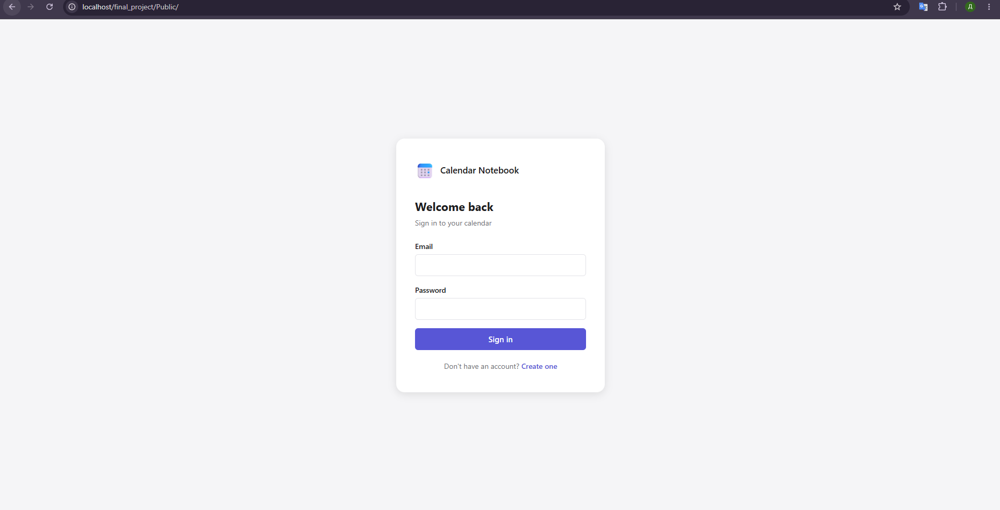
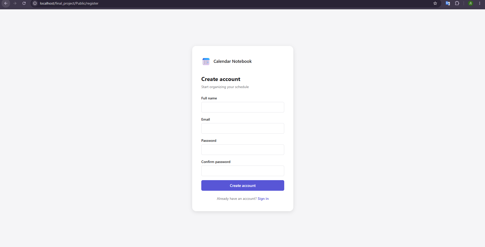
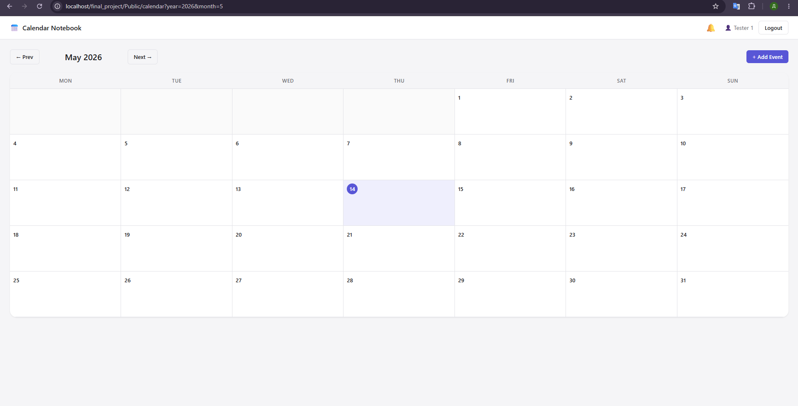
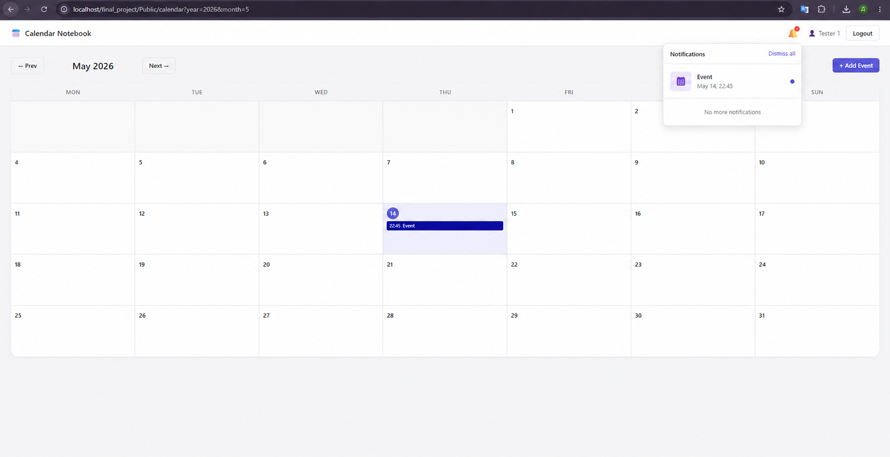
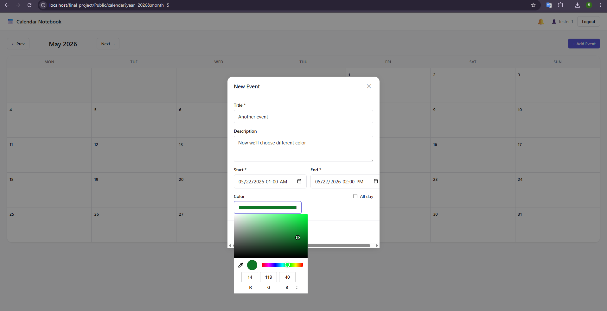
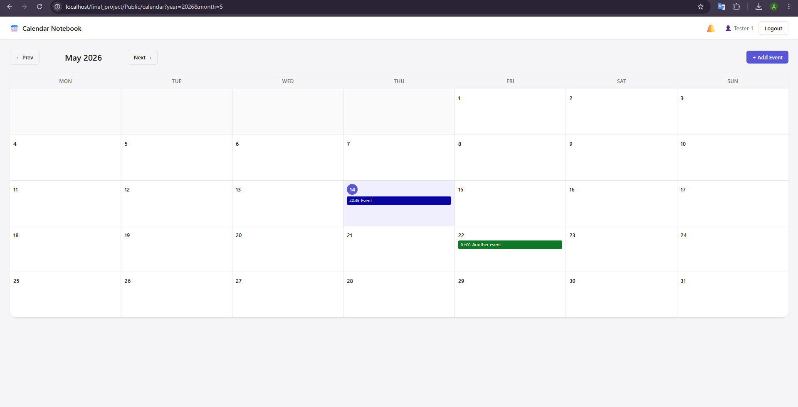

# 📅 Calendar Notebook

A lightweight, feature-rich personal calendar web application built in **PHP** using a custom **MVC-style architecture** without external frameworks or third-party libraries.

---

##  Screenshots

> **Authentication — Login & Register forms**
>
>  
> 

> **Main Calendar View**
>
> 

> **Incoming Event Notification**
>
> 

> **Event Created (custom colour)**
>
> 
> 

---

##  Features

- **User authentication** — registration, login, logout with session management and bcrypt password hashing
- **Monthly calendar grid** — navigate between months, view all your events at a glance
- **CRUD for events** — create, read, update, delete events via a modal popup (AJAX, no page reload)
- **Custom event colours** — every event can have its own hex colour displayed on the grid
- **All-day events** — toggle to mark an event as spanning the full day
- **In-app notifications** — system with automatic polling
- **CSRF protection** — every mutating request is validated against a session-stored token
- **Input validation** — server-side validation for all forms with inline error messages
---

##  Running Locally

### Prerequisites

| Tool            | Version                                 |
|-----------------|-----------------------------------------|
| PHP             | 8.0                                     |
| MySQL / MariaDB | 8.0                                     |
| HTML            | 5                                       |
| CSS             | 3                                       |
| Web server      | Apache / Nginx (or PHP built-in server) |

### Steps

1. **Clone the repository**
```bash
git clone https://github.com/your-username/final_project.git
cd final_project
```

2. **Create the database**
```bash
mysql -u root -p < Database/schema.sql
```

3. **Configure the database connection**
   Open `Config/database.php` and fill in your credentials:

```php
return [
    'host'     => 'localhost',
    'database' => 'calendar',
    'username' => 'your_user',
    'password' => 'your_password',
    'charset'  => 'utf8mb4',
];
```

4. **Start the development server**
```bash
php -S localhost:8000 -t Public
```

5. **Open in the browser**
```
http://localhost:8000
```
 
---

##  Project Structure

```
final_project/
├── Config/
│   ├── app.php              # Timezone, locale, debug settings
│   └── database.php         # DB credentials
├── Database/
│   └── schema.sql           # Tables: users, events, notifications
├── Public/
│   └── index.php            # Entry point — bootstrap & dispatch
├── Routes/
│   └── web.php              # All application routes
├── app/
│   ├── Controllers/
│   │   ├── AuthController.php         # Login / register / logout
│   │   ├── CalendarController.php     # Calendar page
│   │   ├── EventController.php        # Events CRUD (JSON API)
│   │   └── NotificationController.php # Notification polling & mark-seen
│   ├── Core/
│   │   ├── Controller.php   # Base controller (view, redirect, json helpers)
│   │   ├── Database.php     # Singleton PDO wrapper
│   │   ├── Request.php      # HTTP request abstraction
│   │   ├── Response.php     # HTTP response helpers
│   │   └── Router.php       # Regex-based route dispatcher
│   ├── Exceptions/
│   │   ├── NotFoundException.php
│   │   └── ValidationException.php
│   ├── Interfaces/
│   │   ├── NotificationInterface.php  # Contract for notification service
│   │   └── RepositoryInterface.php    # Generic CRUD contract
│   ├── Middleware/
│   │   ├── Auth.php         # Redirect unauthenticated users
│   │   └── Csrf.php         # CSRF token generation & validation
│   ├── Models/
│   │   ├── Event.php
│   │   ├── Notification.php
│   │   └── User.php
│   ├── Repositories/
│   │   ├── EventRepository.php
│   │   ├── NotificationRepository.php
│   │   └── UserRepository.php
│   ├── Services/
│   │   ├── AuthService.php
│   │   ├── EventService.php
│   │   └── NotificationService.php
│   └── Validators/
│       └── EventValidator.php
└── Views/
    ├── auth/
    │   ├── login.php
    │   └── register.php
    ├── calendar/
    │   ├── grid.php
    │   └── index.php
    ├── layouts/
    │   ├── auth.php
    │   └── main.php
    └── part/
        ├── event-chip.php
        ├── event-modal.php
        └── notification-bell.php
```

---

##  Design Patterns

### 1. Singleton — `Database`

**File:** [`app/Core/Database.php`](app/Core/Database.php)

The `Database` class ensures exactly one PDO connection exists for the entire request lifecycle. The constructor is private; all callers go through `Database::getInstance()`.

```php
public static function getInstance()
{
    if (self::$instance === null) {
        self::$instance = new self();
    }
    return self::$instance;
}
```

`__clone()` is blocked and `__wakeup()` throws an exception to prevent any bypass of the pattern.
 
---

### 2. Repository Pattern — `EventRepository`, `UserRepository`, `NotificationRepository`

**Files:** [`app/Repositories/`](app/Repositories/)  
**Contract:** [`app/Interfaces/RepositoryInterface.php`](app/Interfaces/RepositoryInterface.php)

All data access is isolated behind a common interface. The `RepositoryInterface` declares the five standard operations (`findById`, `findAll`, `create`, `update`, `delete`), and each concrete repository adds domain-specific finders on top.

```php
interface RepositoryInterface
{
    public function findById($id);
    public function findAll();
    public function create($data);
    public function update($id, $data);
    public function delete($id);
}
```

Each repository also provides domain-specific methods:

- `EventRepository::findByUserAndDateRange()`
- `NotificationRepository::findPending()`
- `UserRepository::findByEmail()`

---

### 3. Service Layer — `AuthService`, `EventService`, `NotificationService`

**Files:** [`app/Services/`](app/Services/)

All business logic lives in service classes, completely separate from controllers and repositories. Controllers only call services; services only call repositories and validators. This makes each layer independently testable.

Example — `EventService.createEvent()` validates input, persists the event, then automatically schedules a notification, all in one transactional method:

```php
public function createEvent($userId, $data)
{
    $this->eventValidator->validate($data);
    $eventId = $this->eventRepository->create([...]);
    $this->notificationService->createForEvent($eventId, $userId, $startsAt);
    return $this->getEventById($eventId, $userId);
}
```

---

### 4. Front Controller — `Public/index.php` + `Router`

**Files:** [`Public/index.php`](Public/index.php), [`app/Core/Router.php`](app/Core/Router.php)

A single entry point (`Public/index.php`) bootstraps the application — loads all classes, starts the session, validates CSRF — and then hands off to the `Router`. The router matches the incoming method + URI against a regex-compiled route table and calls the appropriate controller action.

```php
// Routes/web.php
$router->get('/calendar',       'CalendarController@index');
$router->post('/events',        'EventController@store');
$router->put('/events/{id}',    'EventController@update');
$router->delete('/events/{id}', 'EventController@destroy');
```

---

### 5. Interface / Contract — `NotificationInterface`

**File:** [`app/Interfaces/NotificationInterface.php`](app/Interfaces/NotificationInterface.php)

`NotificationService` implements `NotificationInterface`, which declares the public contract for notification queries. This decouples the controller from any concrete implementation — the service can be swapped or mocked without changing a single line of the controller.

```php
interface NotificationInterface
{
    public function getPendingNotifications($userId);
    public function markAsSeen($notificationId, $userId);
    public function markAllAsSeen($userId);
}
```

---

##  Programming Principles

### Single Responsibility Principle (SRP)

Each class has exactly one reason to change:

- `Router` — maps URIs to handlers
- `EventValidator` — validates event input fields only
- `Csrf` — generates and validates CSRF tokens only
- `NotificationService` — manages notification lifecycle only
- `EventRepository` — executes SQL against the `events` table only
### Separation of Concerns

- Controllers contain zero SQL
- Services contain zero HTTP logic
- Repositories contain zero business rules
- Views contain minimal presentation-only logic

This layered architecture keeps the application modular and maintainable.

### Don't Repeat Yourself (DRY)

Date-time normalisation lives once in `EventService::normalizeDateTime()` and is reused by both `createEvent()` and `updateEvent()`. Validation logic for dates is centralised in `EventValidator::isValidDatetime()`.

### Open/Closed Principle (OCP)

New resources can be added by introducing additional repositories, services, controllers, and routes without modifying existing components.

### Dependency Injection

Services receive their dependencies through constructors instead of instantiating collaborators internally.

```php
// EventController.php
$this->eventService = new EventService(
    new EventRepository(),
    new EventValidator(),
    new NotificationService(new NotificationRepository())
);
```
 
---

## Database Schema

```
users
  id, name, email (UNIQUE), password, created_at
 
events
  id, user_id (FK → users), title, description,
  color (#hex), starts_at, ends_at, all_day, created_at, updated_at
 
notifications
  id, user_id (FK → users), event_id (FK → events),
  trigger_at, seen (0/1), created_at
```

Indexes are used for optimized monthly calendar queries and notification polling.

---

##  Security

- **Passwords** are hashed with `password_hash(..., PASSWORD_BCRYPT)` and verified with `password_verify()`
- **CSRF** protection using random session-based tokens
- **Session fixation** is prevented by calling `session_regenerate_id(true)`
- **SQL injection** is prevented throughout by using PDO prepared statements exclusively
- **Ownership checks** — every event and notification operation verifies that the resource belongs to the currently authenticated user before acting on it
---

##  Future Improvements

- **Drag-and-drop rescheduling** 
- **Email and push notifications**
- **Export to iCal / Google Calendar** 
